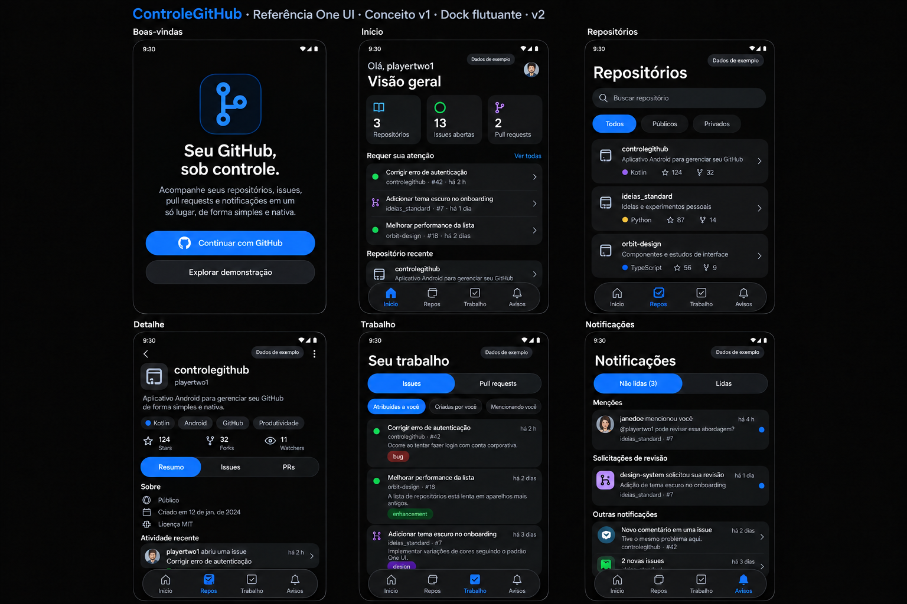
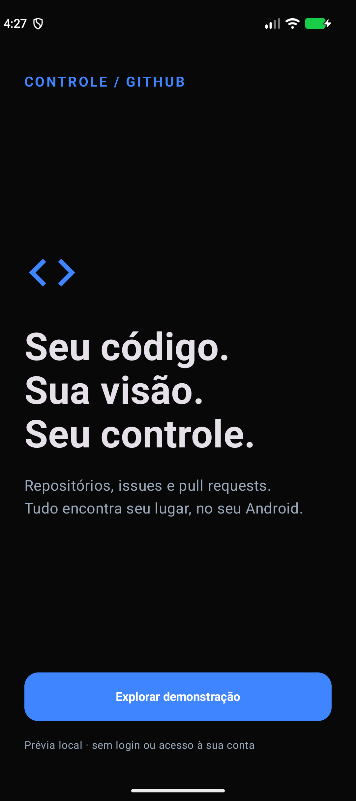
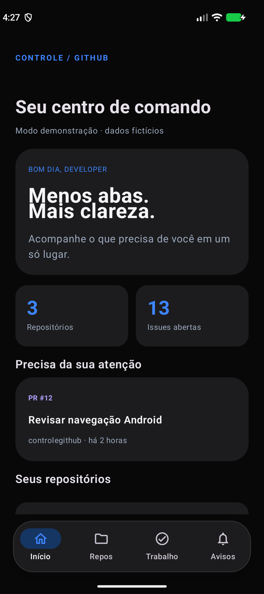
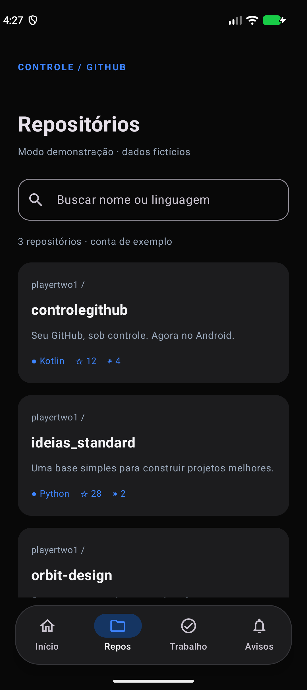
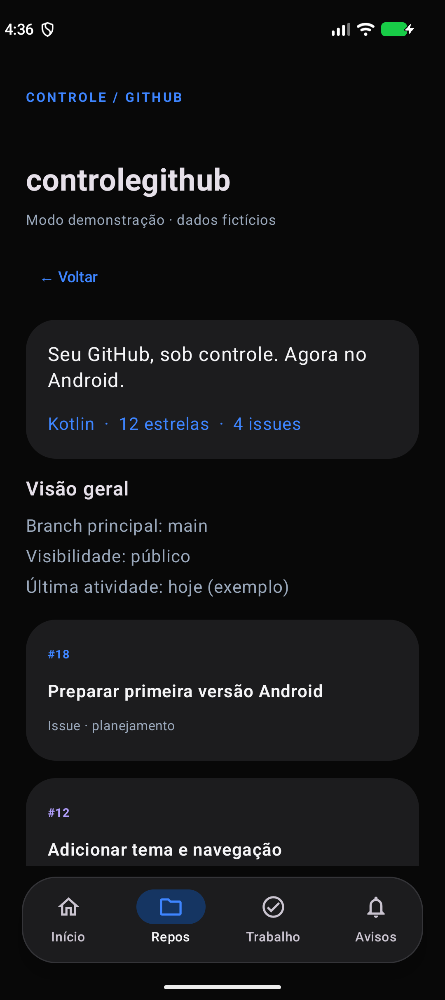
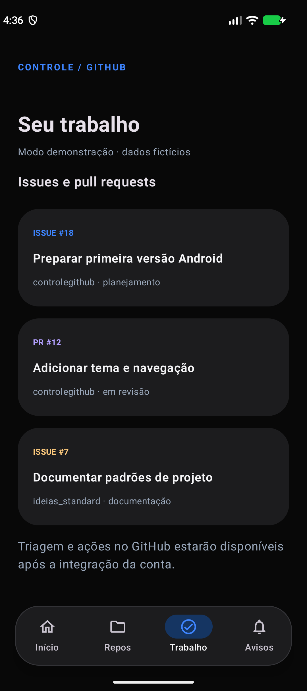
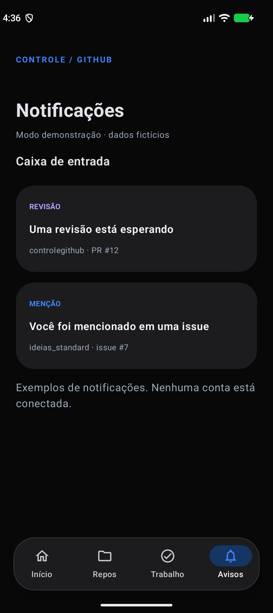

# ControleGitHub

Seu GitHub, sob controle. Um painel Android nativo inspirado na proposta do
[GitDeck](https://github.com/debba/gitdeck), com interface própria para celular.

**Estado: protótipo navegável, com dados fictícios e sem conta conectada.**
Não acessa APIs, não autentica e não altera seus repositórios nesta versão.

## Design do aplicativo final

[Catálogo das 36 telas e estados](docs/design/README.md): inspiração One UI,
tema escuro e menus inferiores flutuantes. Propostas visuais do produto planejado,
separadas do protótipo já executável.



## Capturas do protótipo atual

| Entrada | Painel | Repositórios |
|---|---|---|
|  |  |  |

| Detalhe | Trabalho | Notificações |
|---|---|---|
|  |  |  |

Capturas reais do protótipo no emulador Android. Os números são demonstrativos.

## Executar

1. Abra a pasta no Android Studio e aguarde a sincronização Gradle.
2. Use JDK 17, SDK Android 36 e um dispositivo Android 8.0 (API 26) ou superior.
3. Configure o SDK no Android Studio ou em `local.properties` (não versionado).
4. Execute o módulo `app` e toque em **Explorar demonstração**.

```sh
./gradlew assembleDebug testDebugUnitTest lintDebug
# Com emulador ou dispositivo conectado:
./gradlew connectedDebugAndroidTest
```

Windows: substitua `./gradlew` por `.\gradlew.bat`.
APK local: `app/build/outputs/apk/debug/app-debug.apk`.

## Nesta versão

- Entrada, painel, repositórios, detalhe, trabalho e notificações.
- Busca por nome ou linguagem, incluindo estado vazio.
- Tema escuro, menu inferior flutuante e estado preservado na recriação da Activity.
- Testes de busca e fluxo de navegação; CI com build, testes e lint.
- Base Gold adaptada de [Ideias Standard](https://github.com/playertwo1/ideias_standard).

## Próximos passos

O [roadmap](ROADMAP.md) mantém 21 checkpoints e cinco marcos. O
[backlog](plan/tasks.json) divide a execução em 42 entregas; o
[protocolo](docs/EXECUTION.md) define seleção, refinamento e evidências.
CI confirmado no SHA 643757b. C00.1 (baseline) e C02.1 (configuração OAuth)
estão concluídos. C00.2 e C01.1 (navegação) passaram por auditoria independente.
C01.2 (acessibilidade da navegação) também passou; M0 — Fundação confiável —
está aceito. A próxima entrega a refinar é C03.1 (autorizar conta). Consulte o [estado](PROJECT_STATE.md),
o [backlog](plan/tasks.json) e a [evidência de navegação](docs/evidence/C01.1.md).
As [decisões técnicas](docs/ARCHITECTURE.md) e o [guia visual](docs/DESIGN.md)
orientam a implementação sem introduzir uma arquitetura maior que o necessário.
O [guia de configuração e escopos GitHub](docs/AUTH.md) explica o preparo do OAuth.

## Contribuir

Abra uma issue descrevendo o problema, altere o mínimo necessário, execute os
checks e envie um PR com evidência. Nunca inclua credenciais nas capturas ou logs.
Veja [CONTRIBUTING.md](CONTRIBUTING.md) e [SECURITY.md](SECURITY.md).
