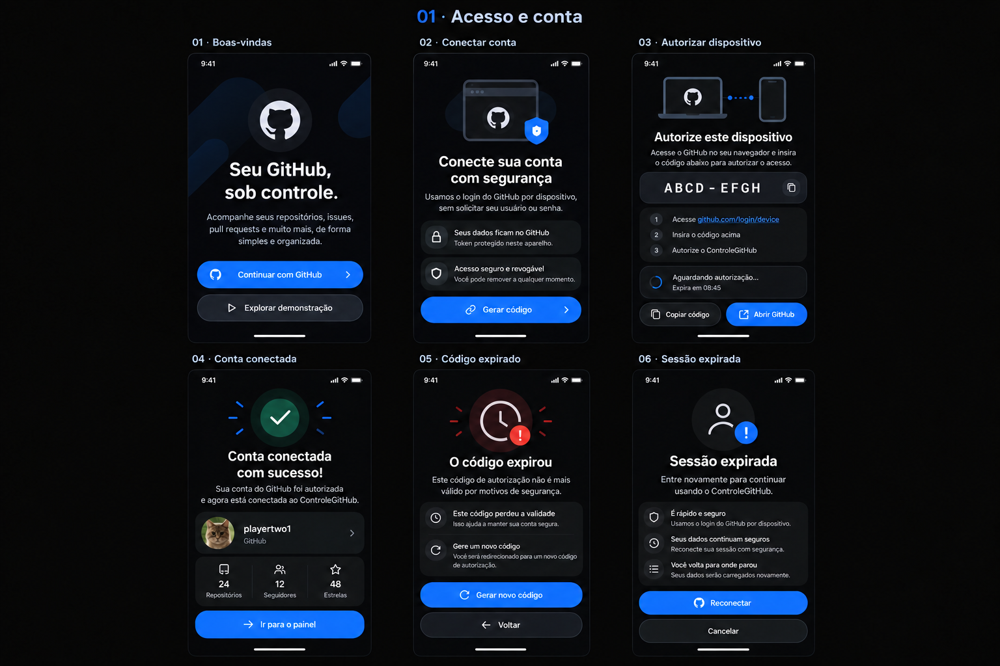
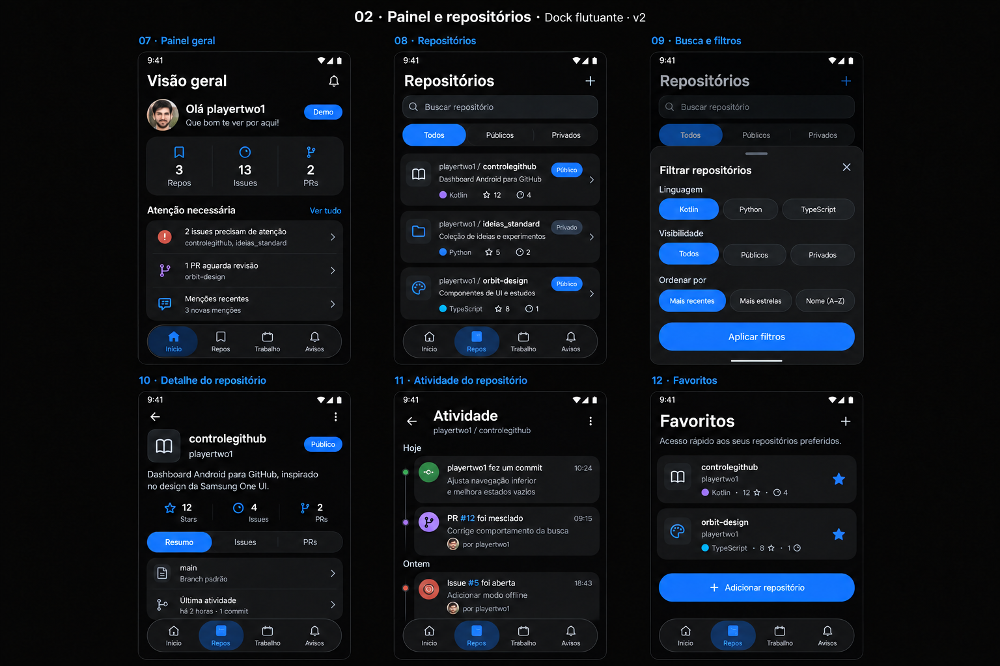
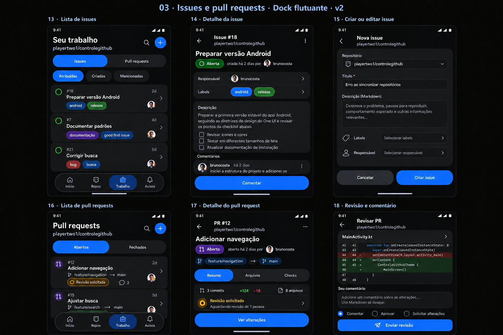
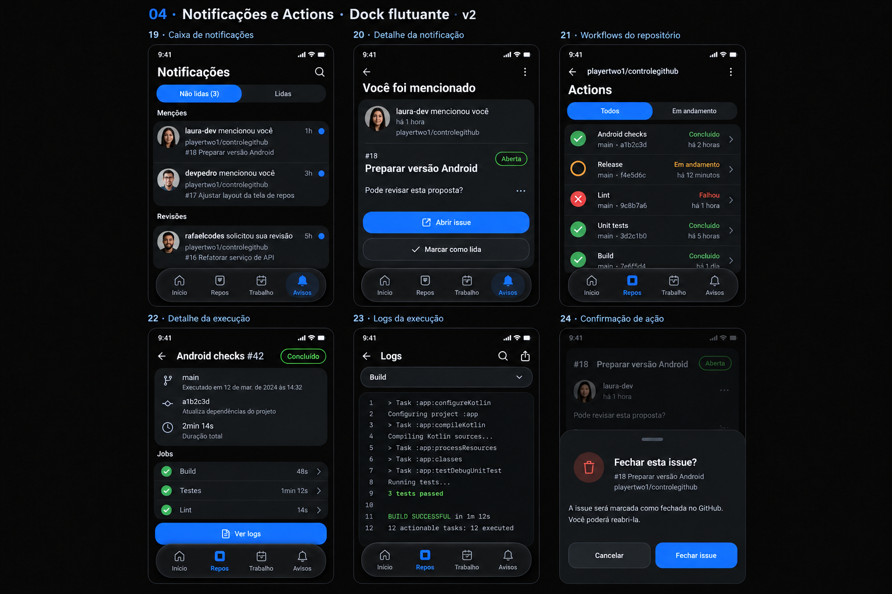
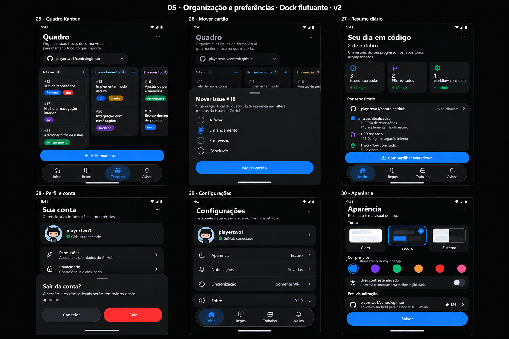
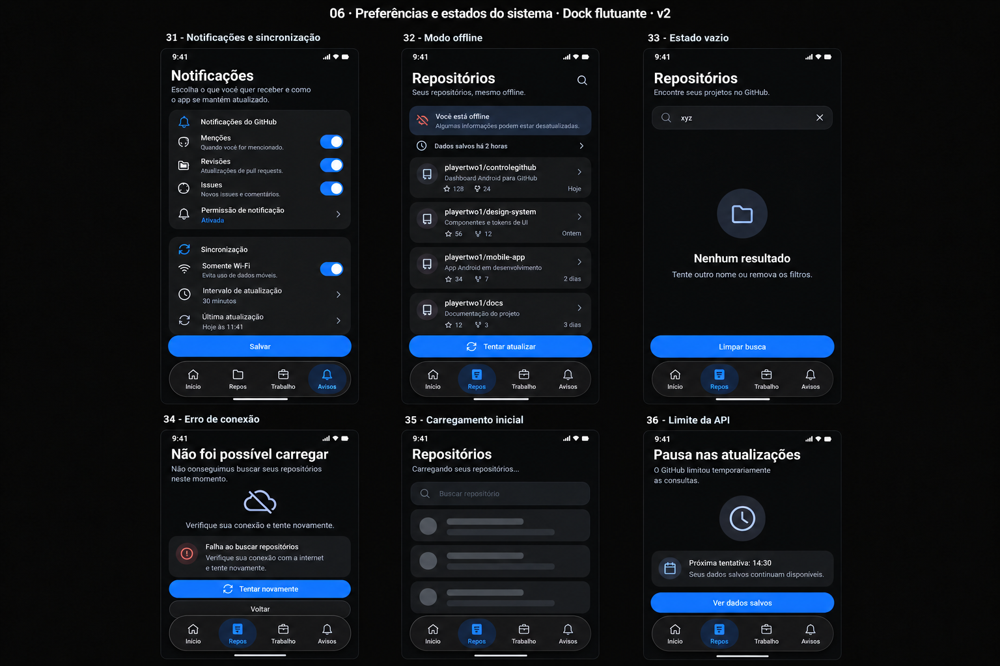

# Catálogo visual — ControleGitHub

**36 telas e estados da versão 1.0 planejada**, em seis pranchas. Referências
conceituais geradas com `image_gen`, inspiração One UI, tema escuro e navegação
inferior flutuante. O app atual tem seis telas demonstrativas; as imagens abaixo
representam o destino do produto e não recursos já implementados.

## Visão geral

## 01 — Acesso e conta

| ID | Tela/estado | Fase |
|---|---|---|
| 01 | Boas-vindas | F0/F1 |
| 02 | Conectar conta | F1 |
| 03 | Autorizar dispositivo | F1 |
| 04 | Conta conectada | F1 |
| 05 | Código expirado | F1 |
| 06 | Sessão expirada | F1 |

## 02 — Painel e repositórios

| ID | Tela/estado | Fase |
|---|---|---|
| 07 | Painel geral | F0/F2 |
| 08 | Repositórios | F0/F1 |
| 09 | Busca e filtros | F1 |
| 10 | Detalhe do repositório | F0/F1 |
| 11 | Atividade do repositório | F2 |
| 12 | Favoritos | F3 |

## 03 — Issues e pull requests

| ID | Tela/estado | Fase |
|---|---|---|
| 13 | Lista de issues | F2 |
| 14 | Detalhe da issue e comentário | F2/F3 |
| 15 | Criar/editar issue | F3 |
| 16 | Lista de pull requests | F2 |
| 17 | Detalhe do pull request e arquivos | F2/F3 |
| 18 | Revisão e comentário | F3 |

## 04 — Notificações e Actions

| ID | Tela/estado | Fase |
|---|---|---|
| 19 | Caixa de notificações | F0/F2 |
| 20 | Detalhe da notificação | F2 |
| 21 | Workflows do repositório | F2 |
| 22 | Detalhe da execução | F2 |
| 23 | Logs da execução | F2 |
| 24 | Confirmação de ação na issue | F3 |

## 05 — Organização e preferências

| ID | Tela/estado | Fase |
|---|---|---|
| 25 | Quadro Kanban | F3 |
| 26 | Mover cartão | F3 |
| 27 | Resumo diário e compartilhamento | F3 |
| 28 | Perfil/conta e confirmação de saída | F1 |
| 29 | Configurações | F2/F4 |
| 30 | Aparência e prévia de tema claro | F4 |

## 06 — Preferências e estados do sistema

| ID | Tela/estado | Fase |
|---|---|---|
| 31 | Notificações e sincronização | F2/F3 |
| 32 | Modo offline com cache | F2 |
| 33 | Busca sem resultados | F0/F1 |
| 34 | Erro de conexão | F1 |
| 35 | Carregamento inicial | F1 |
| 36 | Limite da API | F1/F2 |

## Fluxos e interpretação

Entrada → código → conta → painel. Repos → filtros → detalhe → atividade/Actions.
Trabalho → issue/PR → detalhe → editor/revisão. Avisos → notificação → origem.
Painel → conta/configurações → saída. Kanban organiza cartões localmente;
mover coluna não altera o estado da issue no GitHub.

Privacidade, permissões e Sobre podem abrir painéis contextuais em conta ou
configurações. O tema claro usa a mesma estrutura de rotas. Tablets e provedores
adicionais ficam depois do MVP. As contagens, códigos e avatares são exemplos.

Os prompts estão em [prompts.json](prompts.json) e [revision-prompts.json](revision-prompts.json).
Os rascunhos descartados permanecem na pasta local de geração, fora do Git.
Use os arquivos ligados acima e o
[contrato visual](../DESIGN.md) para implementar. O contrato governa espaçamento,
rotas, rótulos e comportamento quando houver pequenas diferenças nas imagens.
